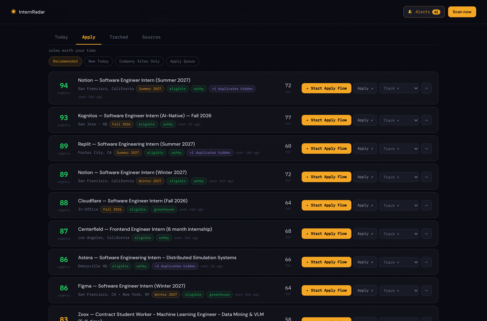
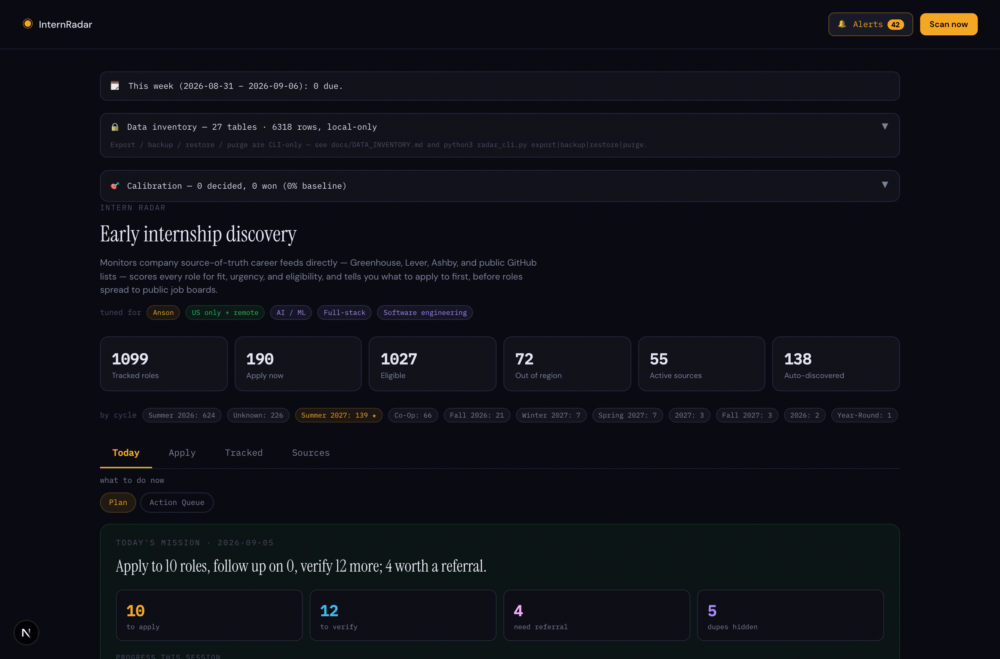
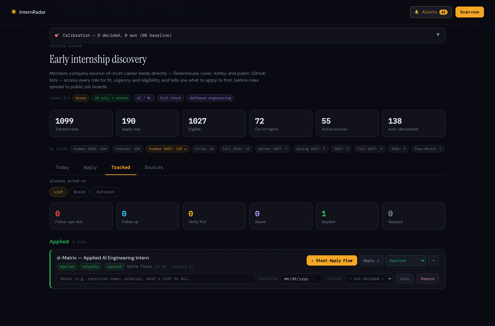
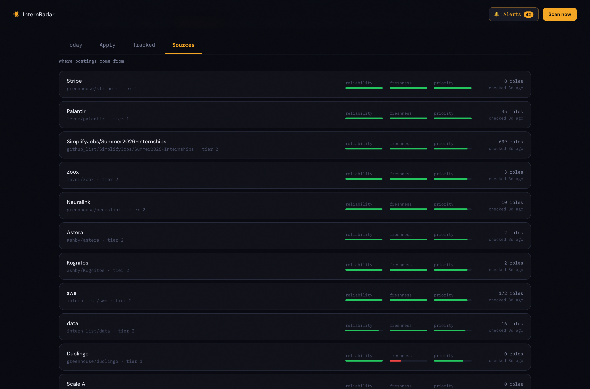

# InternRadar

An internship finder that reads companies' own job-board APIs instead of
aggregators, so roles surface before they spread. Every posting is deduped,
scored deterministically, and checked against an eligibility layer that knows
which roles you actually can't take.

I built it solo. This repo is a walkthrough of the parts I think are worth
reading — the source itself is private.

**Python · FastAPI · SQLite · Next.js · TypeScript · Playwright**

<p align="center">
  
</p>

## Status

Running locally, daily. Not deployed — it holds enough personal data that
local-only is the point, not a limitation I haven't gotten around to.

Current database: **1,099 tracked roles** across **55 active sources**, 138 of
which the crawler discovered and verified on its own. 27 SQLite tables, 6,318
rows, all on one machine.

## Scale

| | |
|---|---|
| Commits | 77 |
| Span | 2026-06-15 → 2026-09-01 |
| Backend | 177 Python files · 27-table SQLite schema · 7 service packages |
| Frontend | 19 TS/TSX files · Next.js App Router |
| Tests | 44 test modules, 1,812 assertions, 49 pytest items |
| Live data | 1,099 roles · 55 active sources · 138 auto-discovered |

## Architecture

```
Greenhouse · Lever · Ashby REST APIs · public GitHub internship lists
   only public, unauthenticated, structured endpoints
        │
        ▼
  scanner → filter → dedupe → score → eligibility → triage
   all deterministic; no model is in the ranking path
        │
        ▼
┌──────────────── SQLite, local-only ────────────────┐
│  27 tables. No cloud sync, no telemetry, no        │
│  account. Export / backup / purge are CLI-only.    │
└────────────────────────────────────────────────────┘
        │
        ├──▶ FastAPI  ──▶ Next.js UI
        └──▶ Playwright apply agent (fills, never submits)
```

The ranking path has no LLM in it anywhere. A model is optional, and only for
polishing draft text — never for deciding what you see or in what order. When no
API key is present every one of those drafts falls back to a template, so the
app is fully functional with no model at all.

[`docs/architecture.md`](docs/architecture.md) is the longer version: how sources
discover, verify, and retire themselves; the dedup order in full; the schema; and
what the tests actually pin.

## Four things worth reading

### 1. Deduplication that refuses to guess

[`code/dedupe.py`](code/dedupe.py) · 590 lines

The same role reaches you three times — the company's board, an aggregator, a
GitHub list. Postings at the same company are linked on **any one of four
signals**, strongest first: an identical ATS requisition id parsed out of the
apply URL, an identical normalized apply URL, the same normalized title plus a
compatible location, or high title-token similarity with a corroborating signal.

The interesting half is the **hard blockers**, which run *before* the signals and
refuse a merge no matter how strong the similarity:

- **A different explicit season.** Summer 2026 and Summer 2027 are not the same
  posting. Collapsing two cycles would silently hide a live opening — the exact
  failure the whole tool exists to prevent.
- **Conflicting level or track.** Undergrad vs Masters, II vs III.
- **Two different requisition ids on the same ATS.** A company that posts one req
  per location has near-identical titles across a dozen rows; the req id is the
  only thing that distinguishes them, so a mismatch is a blocker rather than
  merely a weak signal.

Duplicates are **marked, never deleted**. A canonical pointer is recorded and the
rest collapse behind it, so the grouping stays inspectable and nothing is
destroyed by a bad merge. That's the `+2 duplicates hidden` badge in the
screenshot above.

### 2. Scoring you can argue with

[`code/scoring.py`](code/scoring.py) · 167 lines

Deterministic, and small enough to read in one sitting:

```python
score = 0.45 * freshness + 0.40 * fit
score += 10                    # posted on a source-of-truth board
score += (season_priority / 100) * 10
```

then an eligibility adjustment: `-35` if you're likely blocked, `-25` if it's out
of your region, `+5` if you *uniquely* qualify for a restricted role most
applicants can't take.

Every component returns its own `reasons` list, so a role's position is
explainable line by line rather than being a number you have to trust. Re-tune
the weights and run `rescore` to re-evaluate stored roles without refetching
anything.

The point of `eligible_edge` (`+5`) is the one that took longest to get right: a
citizenship-restricted role is a *penalty* for most people and an *advantage* for
the few who qualify, because the applicant pool collapses. Same posting, opposite
sign, entirely from the profile.

### 3. An apply agent that stops before submitting

[`code/field_mapping.py`](code/field_mapping.py) · 171 lines

Playwright drives a real browser through the mechanical parts of an application.
The boundary is **structural, not advisory**. Every generated plan carries
`auto_submit: False` and `stop_before_submit: True`, and the runner has no
submit-capable calls in it: no `.click()`, no `.press()`, no `.check()`. The only
Playwright interaction beyond `fill()` is `select_option()`, inside the "fill a
field" branch, for `<select>` dropdowns. You cannot ask this agent to submit,
because the code to do it was never written.

Field classification is where the real work is. Two failure modes I had to fix
after finding them in live forms:

**It answered immigration questions.** Work-authorization fields were being
classified safe-to-fill at 0.90 confidence against a 0.75 threshold, with the
value coming from a hardcoded default — so the agent was typing a legal
attestation nobody had entered. Citizenship, sponsorship, visa status, OPT/CPT,
and green-card fields now route to human review as a category, and they can't be
answered from a default.

**It treated every file input as the resume slot.** Any `type=file` field
returned `upload` before the classifier ran, so on a form where a transcript or
photo-ID upload came first, the resume went into that slot — and the later real
upload overwrote the report, so it was invisible. A field now has to name itself
resume or CV. The test fixture already contained this exact form; the old
assertion was pinning the bug.

Sensitive fields — demographics, disability, veteran status, anything protected —
are never auto-filled. Neither are signatures, certifications, or fees.

### 4. Re-verification that derives its own backoff

[`code/lead_refresh.py`](code/lead_refresh.py) · 242 lines

A "verified" listing that nobody re-checks quietly becomes a lie. Measured: 18 of
28 verified leads hadn't been looked at in 44 days, and nothing in the system was
going to.

The scheduler that fixes it is bounded on purpose — 3 leads per cycle, at most
**one request per issuer host**, so ten factsheets on the same domain don't
become ten rapid requests the moment their windows elapse together. Priority is a
total order: near-deadline first, then unconfirmed terms, then oldest evidence,
tie-broken by id so the sequence never depends on SQL row order.

The part I'd point at: **exponential backoff with no new state.** Attempt *N*
waits 2^N days, capped at 14 — derived by reading the existing
`lead_verifications` history table, which already records one row per attempt
with an outcome and a timestamp. A `next_attempt_at` column would have needed a
migration, a backfill, and permanent syncing against a table that already holds
the same facts.

Two rules keep it honest. **A failed read never withdraws legitimacy** — a
timeout means the network broke, not that the award vanished, so the status and
`last_verified_at` are both left alone. And it **fails open**: because `today` is
injectable for tests while SQLite stamps real wall-clock time, the elapsed gap
can compute negative under clock skew. Treating that as "inside the window" would
back a lead off forever and silently stop refreshing it, so only a genuinely
elapsed-but-insufficient gap defers.

## Privacy

Everything is local. No account, no cloud sync, no telemetry, no third-party
analytics. The database is a file; export, backup, restore, and purge are CLI
commands.

**A repo-wide privacy sweep runs in CI.**
[`code/test_privacy_sweep.py`](code/test_privacy_sweep.py) scans every
git-tracked file for email addresses, US phone numbers, and SSN-shaped strings,
and asserts the known-sensitive paths are never tracked at all. It's
allowlist-based rather than zero-tolerance, because committed docs legitimately
contain `example.com` addresses and the redaction tests *have* to contain an
SSN-shaped string to be meaningful — a test that asserts an SSN gets replaced
with a redaction marker needs one to redact.

Work authorization gets specific handling: it's a protected characteristic, so it
lives only in a gitignored profile file, never in committed source. (It's also
why it's blanked out of the screenshots in this repo.) The `.gitignore` blocks
resumes, transcripts, generated essays and PDFs, browser session state, exports,
and backups by pattern rather than by path, so a hand-saved file lands in an
ignored pattern even under an unexpected name.

Drafts sent to an optional cloud model are scrubbed first, and the tests assert
the scrubbing rather than trusting it.

## Generated text that doesn't read as generated

[`code/humanize.py`](code/humanize.py) · 96 lines

Outreach drafts, referral messages, and tailored resume bullets all pass through
one scrubber at the point where they're stored, not at each call site, so a new
feature can't accidentally skip it.

The interesting bug was a fix that overreached. The full scrubber normalizes
capitalization, which turned `iOS` into `IOS` on a generated resume — worse than
the problem it solved. So dash normalization is now a separate, narrower function
used on resume fields, and the ranges got their own rule first: `1—2 sentences`
was becoming `1, 2 sentences` before a numeric-range guard ran ahead of the
general em-dash rule.

Referral messages had a sequencing problem worth more than the typography. The
first message to a stranger opened with the referral ask, and the fallback for an
unmapped relationship type was *also* the referral ask — so a cold first contact
could open with "thanks again for the context on the team… would you be open to
referring me?", fabricating a conversation that never happened. First contact now
asks about the team; the referral ask is a later message you send after they
reply.

## Testing and CI

**44 test modules, 1,812 assertions, 49 pytest items.** GitHub Actions runs the
backend suite on 3.11 plus frontend typecheck, lint, and build on every push and
PR.

Most suites are standalone scripts using a `check(name, cond)` helper rather than
plain `pytest` functions, so each one runs directly (`python3 tests/test_x.py`)
with readable per-assertion output, and a parametrized wrapper collects them all
under pytest for CI. That gets both, but it's a compromise — see below.

One CI detail I'd have missed: the workflow deliberately does **not** pass `-q`,
because combined with `pytest.ini`'s verbosity it became `-qq` and suppressed the
`N passed` line. CI was green and printing no test count at all, which means a
collection that silently shrank would have looked identical to a passing run.

## What I'd do differently

**Hand-maintained stats in the README went stale.** It claimed 168 Python files
and 55,803 lines; the real numbers when I measured for this showcase were 177 and
49,807. Every number in *this* file was measured today, but the lesson is that
they should be generated, not typed.

**The keyword matching is substring-based, and it shows.** `ai` matches inside
"available", `ml` inside "html", `go` inside "Google". These feed the fit score
the UI shows you, so the noise is user-visible. Word-boundary matching from the
start would have cost nothing.

**A related gap: the internship filter still lets some full-time roles through.**
A posting titled "Contract Student Worker — ML Engineer (Full-time)" matches on
`Student` and survives, despite saying full-time in the title. Same root cause.

**The radar page is one 3,450-line component.** It grew a tab at a time and never
got split. It works, and I can still navigate it, but nobody else could.

**Two apps in one repo.** InternRadar and a sibling scholarship finder share the
plumbing — scoring, dedup, verification, drafts — which was the right call for
reuse and the wrong one for surface area. The shared modules now have two sets of
callers with different assumptions, and a change for one has to be checked
against the other.

**The `check()`-style test scripts were a mistake I'd repeat carefully.** The
readable output is genuinely better when a suite fails, but they don't get
pytest's fixtures, parametrization, or assertion introspection, and they needed a
wrapper module to run in CI at all. If I did it again I'd write plain pytest and
fix the output with a reporter plugin.

## Screenshots

| | |
|---|---|
| <br>Today — the daily plan, built from scoring plus tracker state | <br>Apply — ranked by urgency, with fit, eligibility, and hidden duplicates |
| <br>Tracker — saved, applied, follow-ups due first | <br>Sources — per-source reliability, freshness, and priority |

The Sources view is where the self-healing shows: new ATS boards are discovered
from links in the public lists, verified against the live API before being
trusted, promoted to monitored sources, and retired with exponential backoff when
they break. The red freshness bar on one source is that mechanism noticing a
board that stopped returning roles.

## Scope

Only public, unauthenticated, structured endpoints. No LinkedIn, Indeed, or
Handshake scraping, nothing login-gated, no CAPTCHA bypassing, and the apply
agent stops before the submit button by construction.
